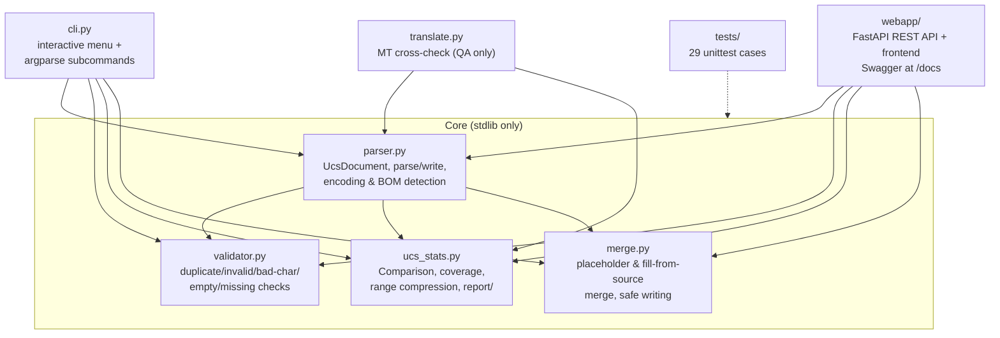

# CoH UCS Toolkit


Comparison, validation, search and migration tooling for Company of Heroes
`.ucs` localization files (`RelicCOH.Russian.ucs` / `RelicCOH.English.ucs`) —
plus a FastAPI web service exposing the same toolkit as a REST API.

Pure Python 3.12 standard library core. `chardet` is an *optional* fallback
for files without a BOM. Runs on Windows.

Born from a real problem: a Complete Edition install showing `$559200 No Key`
in Tales of Valor menus. The full story — reverse engineering, the recovery
of the official English localization, and its verification — is in
[`docs/PROJECT_REPORT.md`](docs/PROJECT_REPORT.md).

## Table of contents

- [Quick start](#quick-start)
- [Architecture](#architecture)
- [UCS file structure (reverse engineered)](#ucs-file-structure-reverse-engineered)
- [Modules](#modules)
- [CLI usage](#cli-usage)
- [Web application](#web-application)
- [Recovered official English text](#recovered-official-english-text)
- [French localization](#french-localization)
- [Machine translation cross-check](#machine-translation-cross-check-translatepy)
- [Arabic localization (unofficial)](#arabic-localization-unofficial)
- [Report](#report)
- [Tests](#tests)
- [Documentation](#documentation)
- [Limitations](#limitations)
- [Contributing & license](#contributing--license)

## Quick start

```powershell
git clone <repo-url> coh-ucs-tools
cd coh-ucs-tools

# core toolkit needs nothing beyond the stdlib; this adds the optional
# chardet fallback and the web app stack
pip install -r requirements.txt

# interactive menu (defaults to the two game paths baked into cli.py)
python cli.py

# or one-shot commands
python cli.py compare --russian "C:\path\RelicCOH.Russian.ucs" --english "C:\path\RelicCOH.English.ucs"

# or the web app with Swagger docs at http://127.0.0.1:8000/docs
python -m uvicorn webapp.main:app --reload
```

## Architecture



The CLI, web app and MT cross-check all delegate to the same four core
modules — no logic is duplicated.

## UCS file structure (reverse engineered)

Findings verified byte-for-byte against the two shipped game files:

| Property           | Value                                                        |
|--------------------|--------------------------------------------------------------|
| Encoding           | UTF-16 little-endian                                         |
| BOM                | `FF FE` (2 bytes) at file start                              |
| Line endings       | CRLF (`\r\n`); no lone `\n` or `\r` occur                    |
| Entry syntax       | `<numeric id><TAB><text>`                                    |
| Separator          | the **first** tab; values may contain additional tabs        |
| Comments           | none — the format has no comment syntax                      |
| Empty values       | legal (`<id><TAB>` then end of line); used ~30-40 times      |
| Duplicates         | none in the shipped files; parser keeps the **last** one     |
| Key range          | 1 … 11 005 454 (Russian), 1 … 809 001 (English)              |

Malformed lines (no tab, non-numeric key) are never silently dropped: the
parser records them with line number and reason, and they surface in
`report/invalid_lines.txt` and in validation.

## Modules

| File            | Purpose                                                            |
|-----------------|--------------------------------------------------------------------|
| `parser.py`     | Encoding/BOM detection, parsing into `UcsDocument`, UCS writer     |
| `validator.py`  | Duplicate IDs, missing IDs, empty values, UTF-16/corruption checks |
| `ucs_stats.py`  | Comparison, coverage stats, range compression, `report/` generator (was `statistics.py`) |
| `merge.py`      | Merge algorithm and safe writing of the merged file                |
| `translate.py`  | Machine translation (comparison/QA only) vs. recovered official text |
| `cli.py`        | Interactive menu + argparse subcommands                            |
| `webapp/`       | FastAPI REST API + static frontend (see [Web application](#web-application)) |
| `tests/`        | `unittest` suite (parser, writer, validator, merge, sorting)       |

Full function-level documentation with signatures and examples:
[`docs/API.md`](docs/API.md).

### Parser

`parse_file(path)` returns a `UcsDocument` dataclass containing:

* `entries: dict[int, str]` — the `Dictionary<int, string>` view (last
  duplicate wins),
* `all_entries` — every valid line in file order (for diagnostics),
* `duplicates` — key → list of line numbers,
* `invalid_lines` — line number, raw text and reason,
* detected `encoding`, `has_bom`, `newline`, `trailing_newline`.

Encoding detection order: UTF-16 BOM (LE/BE) → strict UTF-16-LE probe →
`chardet` (if installed) → UTF-8 fallback.

### Editor / writer

`parser.write_file()` serializes `(id, value)` pairs back to disk using the
conventions captured from the input document (UTF-16-LE, BOM, CRLF, trailing
newline). It **refuses to overwrite an existing file** unless explicitly told
to, so originals can never be clobbered.

### Validation

`validator.validate(doc, reference=None)` reports:

* `invalid-line` (error) — structurally broken lines,
* `duplicate-id` (error) — same ID defined more than once,
* `bad-character` (error) — lone UTF-16 surrogates or control characters
  other than tab (line-corruption indicators); every value is also
  round-tripped through strict UTF-16-LE encoding,
* `empty-value` (warning) — `<id><TAB>` with no text,
* `missing-id` (warning) — IDs present in the reference document but absent
  here.

### Merge algorithm

1. Parse the target (English) and source (Russian) files.
2. Start from a copy of all target entries — **existing English text is never
   modified**.
3. For each ID that exists only in the source, add `ID<TAB><MISSING>`.
   With `--fill-from-source` (menu option 4, mode 2) the source file's
   original text is copied **verbatim** instead of the placeholder.
   **No translation is ever generated** in either mode.
4. Sort all IDs numerically.
5. Write `RelicCOH.English.merged.ucs` with the target file's exact encoding
   conventions (UTF-16-LE + BOM, CRLF, trailing newline).
6. Writing on top of either input file is refused (`ValueError`), so the
   originals are never touched.

### Missing-ID range detection

Consecutive missing IDs are compressed into ranges in the exported files,
e.g. `[559200, 559201, …, 559650]` becomes `559200-559650`.

## CLI usage

```powershell
# interactive menu (defaults to the two game paths baked into cli.py)
python cli.py
python merge.py          # same menu

# custom paths
python cli.py --russian "C:\path\RelicCOH.Russian.ucs" --english "C:\path\RelicCOH.English.ucs"

# non-interactive subcommands
python cli.py compare          # writes the report/ directory
python cli.py statistics       # prints statistics.json content
python cli.py export-missing   # missing IDs as ranges
python cli.py merge            # writes RelicCOH.English.merged.ucs (cwd)
python cli.py merge --fill-from-source   # fill gaps with verbatim source text
                                         # instead of <MISSING> placeholders
python cli.py validate
python cli.py search-id 559200
python cli.py search-text "Panzer"
python cli.py search-text "Pz\.? ?IV" --regex
```

Interactive menu:

```
1 Compare   2 Statistics   3 Export missing IDs   4 Merge
5 Validate  6 Search ID    7 Search Text          8 Exit
```

In menu option 7, prefix the query with `re:` to search by regular
expression; otherwise a case-insensitive substring search is used.

## Web application

**Live demo:** <https://coh-ucs-tools-benmed00.fly.dev> (Fly.io, Paris `cdg`).
Deploy your own copy: [`docs/DEPLOY.md`](docs/DEPLOY.md).

The `webapp/` package serves the toolkit as a REST API plus a static
single-page frontend:

```powershell
pip install -r requirements.txt
python -m uvicorn webapp.main:app --reload
```

Then open <http://127.0.0.1:8000> — dark WW2 command-console theme with
**light theme toggle** (Settings), vanilla JS ES modules (no build step),
Three.js locale globe (click pins → Languages hub), Chart.js coverage donuts.

**SPA sections:** Dashboard · Upload & Analyze · Compare · **Diff** ·
**Ranges heatmap** · **Validator** · **Languages hub** · **Merge wizard**
(preview) · Install detect · **MT lab** · **Glossary** · **Timeline** ·
**Depots & Sources** · **Global search** (fuzzy/regex) · **Bookmarks** ·
**Patch builder** · **SGA browser** · Settings · Tools

* Interactive Swagger/OpenAPI: <http://127.0.0.1:8000/docs>
* Built-in CoH1 UCS version registry (read-only copies at startup)
* State: `uploads/` (gitignored) + `webapp/storage/` (glossary, bookmarks, audit, MT status)
* Optional `UCS_API_KEY` env for API key middleware; 24 h upload cleanup on startup

### REST API surface

Core endpoints plus extended analysis/localization/search — see
[`docs/API.md`](docs/API.md) for the full table (diff, fingerprint, batch
compare, patch build, crossref, …).

Endpoint reference: [`docs/API.md`](docs/API.md#rest-api). The API delegates
to the exact same core modules as the CLI.

## Recovered official English text

The old THQ retail `RelicCOH.English.ucs` (8,578 keys) predates Opposing
Fronts / Tales of Valor. The full official English localization from the
New Steam Version (22,523 keys, no placeholders) can be recovered from the
community-shared copy referenced on the [Steam forums](https://steamcommunity.com/app/228200/discussions/0/353915847943232144/)
(`downloads/RelicCOH.English.NSV.ucs`). It covers 100% of the Russian
Complete Edition's IDs. `RelicCOH.English.complete.ucs` is the union of that
file plus the 157 legacy-only THQ keys.

Recovered/generated game files contain copyrighted text and are **not part
of this repository** (see `.gitignore`). The full recovery story and
verification results are in [`docs/PROJECT_REPORT.md`](docs/PROJECT_REPORT.md).

## French localization

Company of Heroes 1 **was officially released in French**. The Legacy Edition /
New Steam Version French depot (SteamDB depot **4565**, app 4560) ships the full
loose file `CoH/Engine/Locale/French/RelicCoH.French.ucs` (~2.35 MiB) — the
French counterpart of the recovered NSV English file.

On this machine the Complete Edition install has **no** `French` locale folder
(only English and Russian under `CoH\Engine\Locale\`), THQ retail has no French
UCS, and no community-shared French download was found (unlike the [NSV English
Dropbox](https://www.dropbox.com/s/mzsmb0w42ua1z15/RelicCOH.English.ucs?dl=0)
from the Steam forums). **DepotDownloader** was installed; anonymous Steam login
works but depot 4565 cannot be pulled without an account that owns Legacy
Edition.

### Building `RelicCOH.French.complete.ucs`

Place the recovered official French file at `downloads/RelicCOH.French.NSV.ucs`
(from your Steam French depot via DepotDownloader, a friend's install, or a
language-pack copy), then:

```powershell
python build_french.py
python build_french.py --search-only    # local search + report only
python build_french.py --nsv "D:\path\RelicCOH.French.ucs"
```

The build mirrors English complete: **official French NSV** as base, union any
**legacy-only THQ retail French** keys (if present), then `<MISSING>` only for
Russian CE ids with no French source. **No machine translation** is written into
the game file.

Outputs (gitignored when they contain game text):

| File | Purpose |
|---|---|
| `RelicCOH.French.complete.ucs` | Union build (official French only + placeholders) |
| `downloads/RelicCOH.French.NSV.ucs` | Recovered official French source (you provide) |
| `report/french/` | `french_keys.txt`, `missing_in_french.txt`, `statistics.json`, search/recovery notes |

### Installing French in-game

1. Create `CoH\Engine\Locale\French\` if missing (Complete Edition often ships
   without it).
2. Copy `RelicCOH.French.complete.ucs` →
   `CoH\Engine\Locale\French\RelicCOH.French.ucs` (rename on install).
3. Point the game at French via `CoH\locale.ini` (set the active language
   folder to `French`). Some editions also use a top-level `Locale.ini`.
4. Back up originals; **never overwrite** stock files without a `.bak`.

THQ retail path: `Engine\Locale\French\RelicCOH.French.ucs`. Complete Edition
path: `CoH\Engine\Locale\French\RelicCOH.French.ucs`.

## Machine translation cross-check (`translate.py`)

`translate.py` machine-translates the Russian source strings (public Google
Translate endpoint, no API key needed) for every ID missing from the old
English file, then compares the MT output against the recovered official
English text:

```powershell
python translate.py --limit 200    # pilot run
python translate.py                # everything (resumes from downloads/mt_cache.json)
python translate.py --compare-only # rebuild the report from cached MT
```

Similarity is a token-normalized `difflib` ratio (format tokens like `%1%`
stripped, case/punctuation ignored). Outputs:

* `report/translation_comparison.tsv` — one row per ID, sorted most-divergent
  first (id, similarity, MT, official, Russian source),
* `report/translation_summary.json` — bucketed similarity distribution.

MT output is used **only for validating** the recovered official text — it is
never written into a game file.

## Arabic localization (unofficial)

Company of Heroes 1 was **never officially released in Arabic**. There is no
`RelicCOH.Arabic.ucs` in Steam depots or THQ retail installs, and no widely
circulated community Arabic UCS patch was found (local CE install and web
search documented in `report/arabic/search_results.json`).

The deliverable is a clearly labeled **machine-translation artifact**:

| File | Purpose |
|---|---|
| `RelicCOH.Arabic.MT.ucs` | Fan MT (en→ar) from `RelicCOH.English.complete.ucs` |
| `downloads/mt_ar_cache.json` | Resumable MT checkpoint (gitignored) |
| `report/arabic/` | Statistics, validation, 50-key EN vs AR sample TSV |

```powershell
python build_arabic.py --limit 200    # pilot run
python build_arabic.py                # full build (resumes from cache)
python build_arabic.py --report-only  # rebuild report from cache + existing UCS
```

**Important caveats:**

* This is **unofficial fan machine translation** (Google Translate public
  endpoint), **not** Relic/THQ official text. Do not present it as an official
  localization.
* UCS format tokens (`%1%`, `%1NAME%`, etc.) are stripped to placeholders
  before MT and restored afterward so format strings stay intact.
* The CoH1 engine may **not render right-to-left Arabic correctly** in menus
  and UI (LTR layout, cursive joining, mixed Latin/Arabic strings). Expect
  display issues even when the UCS file is valid UTF-16-LE.
* Generated `.ucs` / MT cache files contain copyrighted source text and are
  **gitignored** — never commit them.

### Installing Arabic MT in-game

1. Create the locale folder (game does not ship one):
   `CoH\Engine\Locale\Arabic\`
2. Copy `RelicCOH.Arabic.MT.ucs` →
   `CoH\Engine\Locale\Arabic\RelicCOH.Arabic.ucs`
   (rename on install; the `.MT` suffix marks the unofficial build artifact).
3. Point the game at Arabic — typically by editing `CoH\locale.ini` (or the
   mod's `Locale.ini`) to set the active language folder to `Arabic`. Exact
   steps vary by edition/mod; back up originals first.
4. **Never overwrite** the stock `English` or `Russian` UCS files.

No conflict with other in-progress locale work (e.g. French): Arabic output
uses separate filenames (`RelicCOH.Arabic.MT.ucs`).

## Report

`python cli.py compare` produces:

```
report/
  russian_keys.txt        all Russian IDs, numerically sorted
  english_keys.txt        all English IDs, numerically sorted
  missing_in_english.txt  IDs missing from English, as ranges
  missing_in_russian.txt  IDs missing from Russian, as ranges
  duplicate_keys.txt      duplicated IDs with line numbers
  invalid_lines.txt       malformed lines with reasons
  statistics.json         totals, duplicates, invalid, empty, coverage %
```

Coverage is computed against the union of both key sets.

## Tests

```powershell
python -m unittest discover -s tests -v
```

45 tests: 36 cover the core toolkit and `build_french.py` — parsing (BOM, encodings, tabs in
values, duplicates, invalid lines), writing (round-trip, overwrite
protection), validation (all issue codes), range compression, comparison
statistics, merge behaviour (placeholders only, numeric sorting,
original-file protection), numeric key sorting, and MT token preservation
(`protect_tokens` / `restore_tokens`). 9 more
(`tests/test_webapp.py`, FastAPI TestClient) cover the REST API happy path
(upload → analyze → compare → merge → download) and its error cases.

## Documentation

| Document | Contents |
|---|---|
| [`docs/PROJECT_REPORT.md`](docs/PROJECT_REPORT.md) | Full project report: format reverse engineering, comparison findings, NSV recovery, MT cross-check, verification |
| [`docs/API.md`](docs/API.md) | Python API (signatures + examples) and REST API endpoint reference |
| [`docs/BACKLOG.md`](docs/BACKLOG.md) | Prioritized roadmap (P1/P2/P3) |
| [`CONTRIBUTING.md`](CONTRIBUTING.md) | Dev setup, tests, code style, adding game variants |
| [`LICENSE`](LICENSE) | MIT |

## Limitations

* The toolkit compares and merges **existing** entries only. It never
  translates, never invents localized strings; gaps become `<MISSING>`
  placeholders that a human translator must fill in.
* `<MISSING>` placeholders are displayed verbatim by the game if the merged
  file is installed as-is.
* Duplicate handling ("last occurrence wins") is an assumption based on
  common engine behaviour; the shipped files contain no duplicates to verify
  against.
* The writer normalizes output to one entry per line, numerically sorted —
  original *line order* is not preserved in merged output (the shipped files
  are already sorted, so in practice this is a no-op).
* Encoding detection without a BOM is heuristic (strict UTF-16-LE probe,
  then optional `chardet`).
* Very large files are loaded fully into memory (~2 MB game files are
  instant; this is not a streaming parser).

## Contributing & license

Contributions are welcome — see [`CONTRIBUTING.md`](CONTRIBUTING.md) for dev
setup, test instructions, code style (stdlib-only core, dataclasses and full
type hints) and how to add support for another Relic game.

Licensed under the [MIT License](LICENSE) © 2026 coh-ucs-tools contributors.
Company of Heroes and its localization files are the property of their
respective owners; no game content is distributed with this repository.
