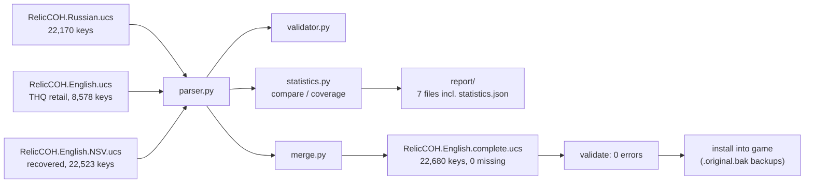
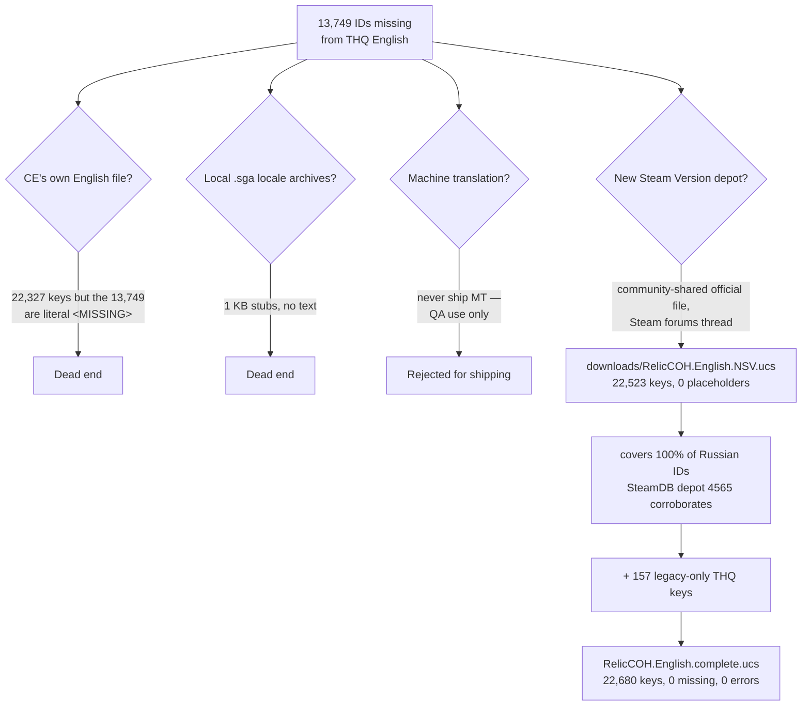

# Project Report — CoH UCS Toolkit

A complete account of how the Company of Heroes 1 `.ucs` localization toolkit
was built, how the missing-English-text problem was diagnosed, and how the
full official English localization was recovered and verified.

- [1. Problem statement](#1-problem-statement)
- [2. Reverse-engineering the UCS format](#2-reverse-engineering-the-ucs-format)
- [3. Toolkit architecture](#3-toolkit-architecture)
- [4. Comparison findings](#4-comparison-findings)
- [5. Recovery of the official English localization](#5-recovery-of-the-official-english-localization)
- [6. Building the complete file](#6-building-the-complete-file)
- [7. Machine-translation cross-check](#7-machine-translation-cross-check)
- [8. Verification](#8-verification)
- [9. Installation into the game](#9-installation-into-the-game)
- [10. Web application](#10-web-application)
- [11. Test suite](#11-test-suite)

## 1. Problem statement

A Company of Heroes — Complete Edition install shows raw string IDs instead
of text in Tales of Valor menus and other DLC content:

```
$559200 No Key
$9419700 No Range
```

This happens because the English `RelicCOH.English.ucs` in use predates the
Opposing Fronts and Tales of Valor expansions: the game looks up an ID, finds
no entry, and prints the ID itself. The goal: diagnose the gap precisely,
and produce a complete, valid English localization file — **without inventing
a single translated string**.

## 2. Reverse-engineering the UCS format

The format was reverse-engineered byte-for-byte from two real game files:

| Source file | Path | Keys |
|---|---|---|
| Russian, Complete Edition | `c:\Games\Company of Heroes - Complete Edition\CoH\Engine\Locale\Russian\RelicCOH.Russian.ucs` | 22,170 |
| English, THQ retail (2006) | `c:\Program Files (x86)\THQ\Company of Heroes\Engine\Locale\English\RelicCOH.English.ucs` | 8,578 |

Findings (all verified against both files):

| Property | Value |
|---|---|
| Encoding | UTF-16 little-endian |
| BOM | `FF FE` (2 bytes) at file start |
| Line endings | CRLF (`\r\n`); no lone `\n` or `\r` occur |
| Entry syntax | `<numeric id><TAB><text>` |
| Separator | the **first** tab; values may contain further tabs |
| Comments | none — the format has no comment syntax |
| Empty values | legal (`<id><TAB>` then end of line); ~30–40 occurrences per file |
| Duplicates | none in shipped files; parser policy: **last occurrence wins** |
| Key range | 1 … 11,005,454 (Russian), 1 … 809,001 (THQ English) |

Malformed lines are never silently dropped — the parser records line number,
raw text and reason for every one.

## 3. Toolkit architecture

Pure Python 3.12 standard library (`chardet` optional, for no-BOM fallback).

| Module | Responsibility |
|---|---|
| `parser.py` | Encoding/BOM detection, parsing into the `UcsDocument` dataclass, UCS writer with overwrite protection |
| `validator.py` | duplicate-id / invalid-line / bad-character / empty-value / missing-id checks |
| `statistics.py` | `Comparison` dataclass, `compress_ranges`, `report/` generator (7 files incl. `statistics.json`) |
| `merge.py` | `<MISSING>`-placeholder merge and verbatim `fill_from_source` merge; never overwrites originals |
| `translate.py` | Machine-translation cross-check of the recovered official text (QA only) |
| `cli.py` | Interactive 8-option menu + argparse subcommands (compare, statistics, export-missing, merge, validate, search-id, search-text) |
| `webapp/` | FastAPI REST API (Swagger at `/docs`) wrapping the same modules |
| `tests/test_ucs_tools.py` | 29 unit tests, all passing |

Data flow through the toolkit:



## 4. Comparison findings

`python cli.py compare` on the two original files (`report/statistics.json`):

| Metric | Value |
|---|---|
| Russian keys | 22,170 |
| THQ English keys | 8,578 |
| Common keys | 8,421 |
| Union of both key sets | 22,327 |
| Missing in English | **13,749** |
| Missing in Russian (legacy-only THQ keys) | 157 |
| English coverage | **38.42 %** |
| Russian coverage | 99.3 % |
| Duplicates / invalid lines (either file) | 0 / 0 |

The 13,749 missing IDs are exactly the Opposing Fronts and Tales of Valor
content — hence `$559200 No Key` in the ToV menus.

**Dead end investigated:** the Complete Edition ships its own English file
(22,327 keys), but all 13,749 expansion IDs in it are literal `"<MISSING>"`
strings — no recoverable text. The local locale `.sga` archives were also
inspected: they are 1 KB stubs containing no text.

## 5. Recovery of the official English localization

Decision tree that led to the recovery:



The official New Steam Version English localization was recovered from a
community-shared copy linked in a
[Steam forums thread](https://steamcommunity.com/app/228200/discussions/0/353915847943232144/)
(app 228200). Authenticity is corroborated by the SteamDB depot 4565 layout,
and independently by the machine-translation cross-check (section 7).

Properties of the recovered file (`downloads/RelicCOH.English.NSV.ucs`):
22,523 keys, zero `<MISSING>` placeholders, valid UTF-16-LE/BOM/CRLF,
covers **100 %** of the Russian Complete Edition ID set.

> The recovered file contains copyrighted game text and is therefore **not
> committed to this repository** (see `.gitignore`).

## 6. Building the complete file

`RelicCOH.English.complete.ucs` = NSV file (22,523 keys) ∪ the 157 keys that
exist only in the THQ retail file:

| Stage | Keys | Missing vs. Russian | Coverage |
|---|---|---|---|
| THQ retail English | 8,578 | 13,749 | 38.42 % |
| Recovered NSV English | 22,523 | 0 | 100 % |
| **complete.ucs (union)** | **22,680** | **0** | **100 %** |

Validation of the result: **0 errors** (no duplicates, no invalid lines, no
bad characters; strict UTF-16-LE round-trip passes).

## 7. Machine-translation cross-check

`translate.py` machine-translated all 13,749 Russian strings missing from the
old English file (free Google `gtx` endpoint, resumable cache in
`downloads/mt_cache.json`) and compared the MT output with the recovered
official English (token-normalized `difflib` similarity):

| Metric | Value |
|---|---|
| Pairs compared | 13,733 |
| Mean similarity | 0.659 |
| Median similarity | 0.653 |
| ≥ 0.9 (identical or near) | 2,517 |
| 0.7 – 0.9 (close) | 3,190 |
| 0.4 – 0.7 (divergent) | 6,371 |
| < 0.4 (very different) | 1,655 |
| ≥ 0.7 total | **5,707** |

Manual review of divergent rows shows synonym-level phrasing differences
(e.g. MT literalism vs. idiomatic game text), not different meanings —
strong evidence the recovered file is the genuine official translation, not
a machine or fan translation. Reports: `report/translation_comparison.tsv`,
`report/translation_summary.json`. MT output is used **only for QA** — it is
never written into any game file.

## 8. Verification

A deep verification pass over `RelicCOH.English.complete.ucs`
(`report/verification_raw.json`; a human-readable `report/verification.md`
is being produced from it) confirms:

* Byte-level format: BOM `FF FE`, strict UTF-16-LE decode, 22,680 CRLF line
  endings, zero lone LF/CR, trailing CRLF, zero NUL/stray-BOM characters.
* Parse: 22,680 keys, 0 duplicates, 0 invalid lines.
* Set logic: complete = NSV ∪ THQ exactly (no extra, no missing keys);
  157 legacy-only keys present; **zero** value mismatches vs. NSV.
* Coverage: 100 % of Russian CE IDs, 100 % of CE-English IDs, 100 % of THQ IDs.
* Content: 0 `<MISSING>` placeholders, 0 Cyrillic leftovers,
  45 legitimately-empty values (matching the originals' pattern).

## 9. Installation into the game

The complete file was installed into the Complete Edition at both
`Engine\Locale\English` and `CoH\Engine\Locale\English`, with the originals
preserved as `.original.bak`. The THQ retail install requires an elevated
copy into `Program Files (x86)` (instructions provided to the user).

## 10. Web application

A FastAPI web application (`webapp/`) exposes the toolkit as a REST API with
interactive Swagger documentation at `/docs`: file upload and analysis,
entry browsing/search, validation, comparison, merging with download of the
result, a registry of known CoH1 UCS versions, and a curated external-tools
list. It delegates entirely to the existing modules — no logic is
reimplemented. See [`docs/API.md`](API.md) for the endpoint reference.

## 11. Test suite

```powershell
python -m unittest discover -s tests -v
```

29 unit tests — parsing (BOM, encodings, tabs in values, duplicates, invalid
lines), writing (round-trip, overwrite protection), validation (every issue
code), range compression, comparison statistics, merge behaviour (both
modes, numeric sorting, original-file protection) — all passing.
